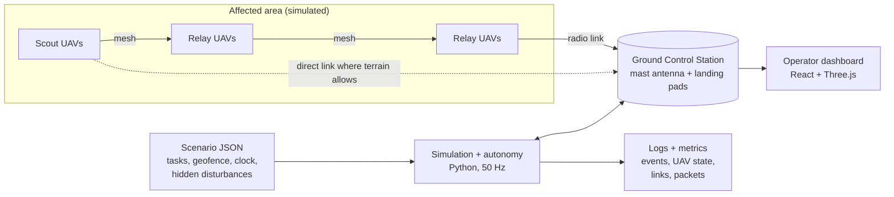
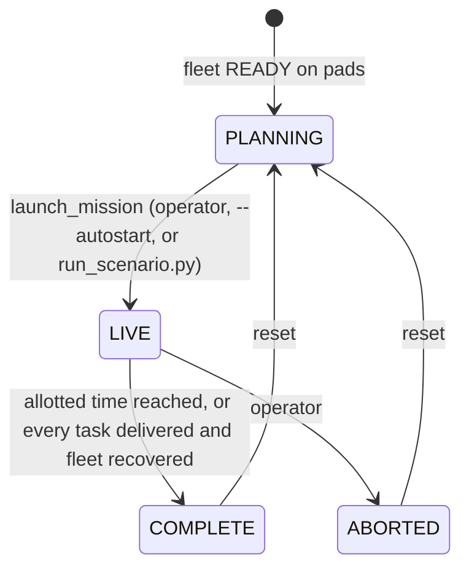
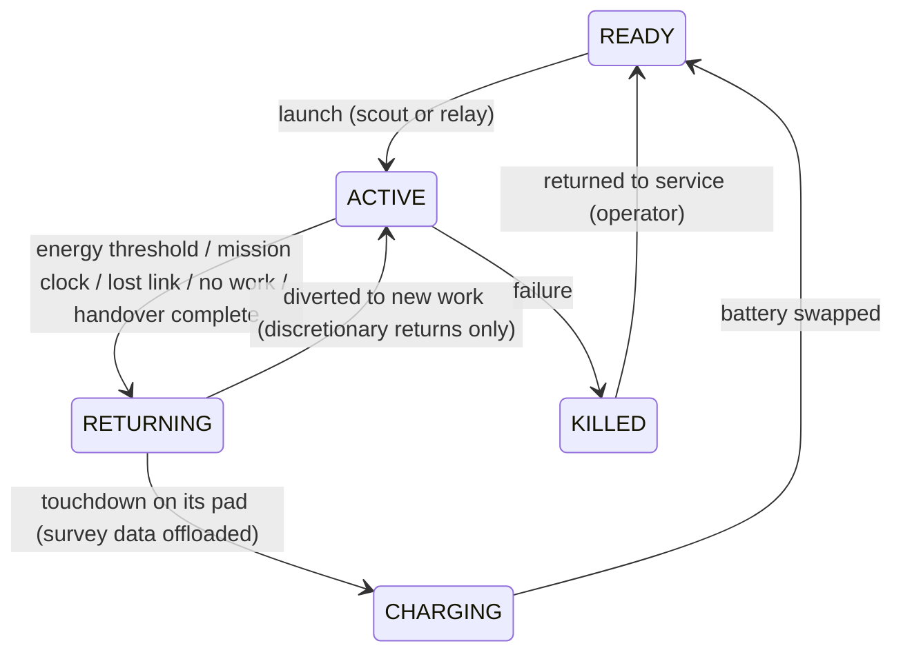

# C-DAWN software architecture — UAV-X Resilient BVLOS Swarm

This document describes how the software is put together: what runs, in what order, at what rate, and which module owns each decision the challenge asks the swarm to make. The [README](../README.md) covers installation, results and usage.

## 1. System context

The GCS is a fixed ground node outside the affected area (`sim/world.py: GroundStation`). It has an antenna on a 10 m mast and a row of landing and charging pads. It is not an aircraft: it cannot fail or run out of battery. Every packet is addressed to it, and every aircraft launches from and returns to one of its pads.

## 2. Layers and rates

The autonomy is layered, fastest first. All layers run in one process on one clock (`gcs/backend/demo_controller.py: DemoController.step`), so a headless benchmark and the live dashboard execute exactly the same code.

| Layer | Rate | Module | Decides |
|---|---|---|---|
| Physics | 50 Hz | `sim/physics.py`, `sim/wind.py` | Underactuated multirotor, attitude lag, drag, terrain-sheared wind with gusts |
| Flight control | 50 Hz | `ltc/pid_baseline.py` (default), `ltc/ltc_controller.py` | Thrust vector to track the setpoint |
| Guidance | 50 Hz | `sim/guidance.py` | Task allocation, pre-emption, routes, energy-aware return, landing, recharge, lost-link failsafe, geofence |
| Separation assurance | 50 Hz | `sim/deconfliction.py` | Pushes setpoints apart when the predicted closest approach is under 30 m |
| RF channel | 50 Hz | `sim/rf_channel.py`, `sim/world.py` | Friis + knife-edge terrain diffraction (ITU-R P.526) + Rician fading + interference, per link and to the GCS |
| Swarm awareness | 10 Hz | `mesh/awareness.py` | Beliefs from measurements: heartbeats, acks, noise, path-loss offset, wind, cloud, GNSS check |
| Relay failover | 10 Hz | `mesh/election.py` | A relay silent for 200 ms is replaced by the best scout |
| Packet traffic | 10 Hz | `mesh/traffic.py` | Telemetry and survey data hop by hop over published routes; store-and-forward; delivery; latency |
| Causal diagnosis | 10 Hz | `scm/` | Why a link is failing (terrain / range / interference / weather); controlled do(Δz) altitude tests |
| Interference response | 5 Hz | `mesh/interference.py` | Detects a noise-floor rise, localises the source, withdraws scouts, holds dead-zone targets |
| Routing | 2 Hz + on failover | `mesh/routing.py` | SCM-aware Dijkstra, with the GCS as a node |
| Relay placement | 2 Hz | `gnn/relay_optimizer.py` | Where each relay should hold: E(3)-equivariant GNN proposal + 20 steps of gradient refinement on a differentiable terrain link budget |
| Role management | 1 Hz | `mesh/roles.py` | How many relays, who flies them, launches from the pads, make-before-break handover, standby |
| Mission clock and scenario | per tick | `mission/scenario.py`, `mission/disturbances.py` | Plays hidden disturbances; ends the mission at the allotted time |
| Metrics and logs | 10 Hz / 1 Hz | `mission/metrics.py`, `mission/recorder.py` | Everything the challenge scores |

## 3. What the autonomy knows, and how it finds out

The simulator knows the truth. The autonomy is never given it. A disturbance changes the physics or the radio and nothing else: no flag is set, no callback fires, and no `if` in the autonomy mentions it. Everything the swarm decides from comes through `mesh/awareness.py`, built from what a real swarm could measure.

| Something happens | What the simulator changes | What the swarm observes | What it concludes |
|---|---|---|---|
| A UAV fails | It falls; its radio stops | Nobody measures a link to it for 200 ms (heartbeat) | Relay slot empty → failover; after 5 s its task is released; after 20 s its undelivered data is written off and the target re-opened |
| A UAV's radio fails | Its links go to zero | The same missing heartbeat, and its own packets stop being acknowledged | Treated exactly like a failure (the swarm cannot tell them apart); after 60 s without acks the aircraft itself returns home; when heard again it rejoins |
| Interference source / comm outage | Noise floor at receivers near it; bearings on DF arrays | Each receiver's noise reading; each DF array's bearings (`sim/df_sensor.py`) | Source localised by cross-fixing; the *estimate* enters relay planning and the chain requirement |
| Area-wide RF degradation | Noise floor everywhere | Every receiver's reading rises | Measured floor used by relay placement and the relay chain |
| Packet loss / a link failing | Delivery ratio on the affected links | Link measurements; missing acknowledgements | Routing, relay count and failsafes react to the measured links |
| Battery / motor fault | Power draw and thrust authority | Battery current vs the draw expected for the thrust produced | The aircraft's own drain factor rises; its RTH threshold and task affordability follow |
| Heavy rain | Wet-antenna loss, power draw, turbulence, lower cloud base | RSSI below what the terrain map predicts; current draw; wind-estimator spread; the optical cloud sensor | Extra path loss in every link budget; causal model's weather term; a ceiling found by flying into cloud |
| GNSS degradation | The navigation solution drifts | Radio ranging to other aircraft and to the GCS disagrees with GNSS-implied distances | After 2 s of disagreement: terrain-relative navigation |
| Wind | The wind field | Onboard wind estimators; the GCS mast anemometer before launch | Wind-aware return times |
| New emergency reported | A task appears at its release time | The report reaches the GCS | Tasking, pre-emption, relay chain extended |

The only places that read the truth are the sensor models: `sim/runner.py` (links, noise readings, cloud sensor, ranging), `sim/df_sensor.py` (DF bearings), `sim/drone.py` (GNSS fix, battery), the anemometer in `DemoController._read_anemometer`, and the metrics and logs, which measure performance. `tests/test_awareness.py` audits the autonomy modules' source for any read of simulator truth, and checks each disturbance is noticed rather than announced.

One simplification remains: guidance uses the aircraft's position as its position estimate. GNSS error is applied as an offset on the setpoint it flies (`sim/runner.py`), so a drifting solution still pulls the aircraft off track until the swarm notices.

## 4. The decisions the challenge asks for, and where they are made

### Survey all assigned locations — `sim/guidance.py: assign_targets`
Greedy on value rate: each step assigns the (scout, task) pair with the highest `priority_weight / (ETA + 60 s)`. A pair is only considered if the energy model says the scout can reach the task, survey it and get home with a landing reserve, and the whole trip fits inside the mission clock. A task is surveyed after a 2 s dwell within 30 m horizontally and below 70 m AGL. It counts as *delivered* only when all of its data chunks have reached the GCS.

### Maintain end-to-end communication — `mesh/roles.py`, `gnn/`, `mesh/routing.py`, `mesh/traffic.py`
- **How many relays** (`RoleManager.estimate_relays`): from the GCS antenna the role manager walks a chain along the valley to every point where work is happening. Those points are a scout on task, an open reachable target, an aircraft carrying undelivered data, and an aircraft flying home. Each hop is placed at the farthest point the previous hop still reaches with at least 15 dB SNR. That link budget uses the real terrain between them and any interference the swarm has detected. The number of intermediate hops is the relay requirement.
- **Where relays go** (`RelayOptimizer`): the chain's hop points seed the GNN proposal, and a short gradient refinement then polishes it against the live link budget.
- **Which path packets take** (`SCMAwareRouter`): Dijkstra on `-log(PDR)` blended with the causal layer's link-stability estimate. The GCS is a node.
- **What actually arrives** (`TrafficSimulator`): packets are moved hop by hop along the published routes, with link-layer retries. Telemetry older than 2 s is dropped. Survey chunks wait in custody when no route exists and are forwarded later, or offloaded over the wire when the carrier lands.

### Dynamically assign relay UAVs — `mesh/roles.py: RoleManager.update`
- **Deficit:** launch a charged aircraft from a pad first. Otherwise promote the scout whose current task is worth least and which is closest to the missing hop. At least one scout always remains.
- **Surplus:** after 25 s a spare relay goes back to surveying if there is work, or home if there is none.
- **Logging:** every role change is recorded as a relay reallocation with its reason. A change undone within 30 s is counted as a *flap*.

### Reconfigure when communication degrades, a UAV fails, or a UAV returns to recharge
- **Relay failure:** `mesh/election.py` notices the missing heartbeat within about 200 ms, promotes a scout, and the router recomputes immediately. The role manager then settles the steady state, for example by launching a charged aircraft.
- **Degradation:** the causal layer attributes the loss. The interference response localises the source and pulls scouts back into coverage. Relay placement re-plans against the new link budget, and the chain requirement grows if the interference demands it.
- **Recharging:** a relay whose battery reaches its handover threshold calls up a replacement to its station. The threshold is the energy needed to hold on while a replacement launches and flies out, then fly home. The relay leaves only when the replacement is on station, so the chain is never open (make-before-break).
- **Lost link:** an aircraft whose packets have not been acknowledged by the GCS for 60 s returns home.

### Prioritise newly emerging high-priority regions — `sim/guidance.py`, `mission/disturbances.py`
A new task or region is invisible to the swarm until its release time. Tasks are weighted P1 = 3, P2 = 2, P3 = 1. A new priority-1 task that no idle scout can take pre-empts the best-placed scout on lower-priority work, unless that scout is already over its target. A region is expanded into survey cells. Idle scouts with a healthy battery loiter at a standby point mid-valley, inside relay coverage. A scout on a discretionary return is turned round for new work it can afford.

### Complete the mission safely and within the allotted time
- **Energy** (`sim/energy.py`): every estimate uses the airframe's own drain law, a wind-aware ground speed (return legs are usually into the valley wind) and a 1.2 safety factor. The return-to-home trigger is the energy needed to get home from where the aircraft is, plus an 8% landing reserve. It is not a fixed percentage.
- **Clock:** a task is only accepted if the round trip fits before the deadline. Each aircraft turns for home when the remaining time equals its time home plus 20 s.
- **Geofence** (`sim/world.py: Geofence`): every setpoint is projected at least 40 m inside the keep-in polygon, and below the AGL ceiling. Excursions of the true position are counted.
- **Separation** (`sim/deconfliction.py`): prediction of the closest point of approach, with a horizontal push and a vertical split. Take-offs from the pads are spaced 4 s apart.

## 5. Mission lifecycle

Per aircraft:

## 6. Data model and interfaces

- **Scenario (input):** JSON, documented in `mission/scenario.py`. Positions can be given in local metres or along the valley corridor, so a scenario is meaningful on any terrain. Disturbance types: `uav_failure`, `comm_outage` (regional interference, one aircraft's radio, the GCS receiver, or area-wide), `packet_loss`, `link_failure`, `new_task` (point or region), `battery_fault`, `weather`, `wind_gust`, `phase`.
- **Logs (output):** `mission/recorder.py` writes `run_meta.json`, `scenario_resolved.json`, `events.jsonl`, `uav_state.csv` (1 Hz), `links.csv` (1 Hz), `packets.csv` and `metrics.json`. When the organisers publish their standard log format, this module and the scenario loader are the two adapter points.
- **Live API:** FastAPI (`gcs/backend/app.py`) with a 20 Hz WebSocket snapshot, `POST /api/cmd/<command>` for every operator action, `GET /api/summary` for the full metrics, `/api/terrain`, `/api/theatres`, and the cluster endpoints.

## 7. Deployment

- **One laptop:** `python run_node.py`.
- **Three laptops** (`cluster/`): ALPHA runs the simulation. BRAVO runs relay placement and causal diagnosis on the live stream and returns results. CHARLIE runs SITREP synthesis. Work is delegated only while results keep arriving: if an edge node is silent for 1.5 s, ALPHA takes the work back.
- **Headless:** `python run_scenario.py <scenario>` and `python -m bench.uavx_suite` use the same `DemoController`, with the display-only shadow controller switched off. They run roughly 5–9× faster than real time on a laptop.

## 8. Simulation framework

The challenge allows "any open-source simulation framework … or equivalent". C-DAWN is its own Python simulator, chosen so that the RF channel, the terrain and the autonomy share one model. The ridge a relay flies around is the same heightmap the link budget diffracts over. It is deterministic for a given seed and runs on a laptop without a GPU.

The autonomy talks to the vehicle only through setpoints (`drone.target_position`, `target_velocity`) and state. A PX4 SITL / ROS 2 bridge therefore needs no change to the autonomy: it replaces `sim/physics.py` and the controller hook with MAVLink or ROS 2 offboard setpoints. This is planned work for Stage 2, not yet implemented.
